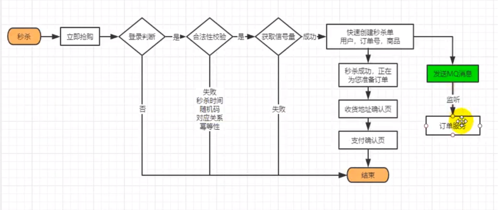

接口幂等

​	token 机制  给按钮添加一个token ，提交后就去验证token， 若token有效，则继续流程， 并且删除token（保证原子性），若无效， 则给出相应提示

​	

秒杀 流程  

​		上架秒杀商品时，添加随机码，并且设置该随机码的信号量

下单 流程

​	用户信息

​	物流信息

​	支付信息

​	促销信息

​	订单信息

​	商品信息

​		下单后，验证令牌，验证用户信息，验证订单信息，查询库存，生成订单

​		使用消息可靠性加最终一致性

单点登录   

​		SpringSession

​		跨域名登录

​			重点：最核心的就是登录服务器需要留下登录信息（登录页保存session）， 登录服务器需要知道是哪个请求过来登录的（请求地址携带自己的url）

​			登录服务器 sso.server

​			service.com 判断自己是否登录（@RequestParam(value = "tokken", required =  false) String token）

​			若有 token 则 用token 去登录服务器获取真正的用户信息， 并保存到session

​			所有登录请求（service.com， 并且携带自己的地址，方便登录服务器登录完成后，重新跳转回来）都重定向到 sso.server.com/login 登录页

​			判断登录页是否有sso_token (@CookieValue("sso_token", required = false) String sso_token)

​			若有则说明当前会话已经登录过， 则重定向到来源(service.com),并且返回token

​			若没有，则进行登录

上架流程

   保存到es->修改数据库状态码

CompletableFuture

分布式信号量 

trysetpremites()

  redis占坑  setIfAbsent()    "setnx"

redisson

死信队列

redis lua脚本，保证原则性操作

CompletableFuture

​	//两个CompletionStage，谁执行返回的结果快，我就用那个CompletionStage的结果进行下一步的消耗操作

​	**[acceptEither](https://docs.oracle.com/javase/8/docs/api/java/util/concurrent/CompletableFuture.html#acceptEither-java.util.concurrent.CompletionStage-java.util.function.Consumer-)**([CompletionStage](https://docs.oracle.com/javase/8/docs/api/java/util/concurrent/CompletionStage.html)<? extends [T](https://docs.oracle.com/javase/8/docs/api/java/util/concurrent/CompletableFuture.html)> other, [Consumer](https://docs.oracle.com/javase/8/docs/api/java/util/function/Consumer.html)<? super [T](https://docs.oracle.com/javase/8/docs/api/java/util/concurrent/CompletableFuture.html)> action)

​	acceptEitherAsync(CompletionStage<? extends T> other, Consumer<? super T> action)

​	acceptEitherAsync(CompletionStage<? extends T> other, Consumer<? super T> action, Executor executor)

​	

​	// 当所有complatableFuture都执行完成后，返回一个complatableFuture

​	**[allOf](https://docs.oracle.com/javase/8/docs/api/java/util/concurrent/CompletableFuture.html#allOf-java.util.concurrent.CompletableFuture...-)**([CompletableFuture](https://docs.oracle.com/javase/8/docs/api/java/util/concurrent/CompletableFuture.html)<?>... cfs)

​	**[anyOf](https://docs.oracle.com/javase/8/docs/api/java/util/concurrent/CompletableFuture.html#anyOf-java.util.concurrent.CompletableFuture...-)**([CompletableFuture](https://docs.oracle.com/javase/8/docs/api/java/util/concurrent/CompletableFuture.html)<?>... cfs)

​	// 两个CompletionStage，谁执行返回的结果快，我就用那个CompletionStage的结果进行下一步的转化操作

​	**[applyToEither](https://docs.oracle.com/javase/8/docs/api/java/util/concurrent/CompletableFuture.html#applyToEither-java.util.concurrent.CompletionStage-java.util.function.Function-)**([CompletionStage](https://docs.oracle.com/javase/8/docs/api/java/util/concurrent/CompletionStage.html)<? extends [T](https://docs.oracle.com/javase/8/docs/api/java/util/concurrent/CompletableFuture.html)> other, [Function](https://docs.oracle.com/javase/8/docs/api/java/util/function/Function.html)<? super [T](https://docs.oracle.com/javase/8/docs/api/java/util/concurrent/CompletableFuture.html),U> fn)

​	applyToEitherAsync(CompletionStage<? extends T> other, Function<? super T,U> fn)

​	applyToEitherAsync(CompletionStage<? extends T> other, Function<? super T,U> fn, Executor executor)

​	

​	//	执行任务完成时对结果的处理,第一个出现异常继续执行

​	handle(BiFunction<? super T,Throwable,? extends U> fn)

​	**[handleAsync](https://docs.oracle.com/javase/8/docs/api/java/util/concurrent/CompletableFuture.html#handleAsync-java.util.function.BiFunction-)**([BiFunction](https://docs.oracle.com/javase/8/docs/api/java/util/function/BiFunction.html)<? super [T](https://docs.oracle.com/javase/8/docs/api/java/util/concurrent/CompletableFuture.html),[Throwable](https://docs.oracle.com/javase/8/docs/api/java/lang/Throwable.html),? extends U> fn)

​	**[handleAsync](https://docs.oracle.com/javase/8/docs/api/java/util/concurrent/CompletableFuture.html#handleAsync-java.util.function.BiFunction-java.util.concurrent.Executor-)**([BiFunction](https://docs.oracle.com/javase/8/docs/api/java/util/function/BiFunction.html)<? super [T](https://docs.oracle.com/javase/8/docs/api/java/util/concurrent/CompletableFuture.html),[Throwable](https://docs.oracle.com/javase/8/docs/api/java/lang/Throwable.html),? extends U> fn, [Executor](https://docs.oracle.com/javase/8/docs/api/java/util/concurrent/Executor.html) executor)

​	//两个CompletionStage，都完成了计算才会执行下一步的操作（Runnable）

​	**[runAfterBoth](https://docs.oracle.com/javase/8/docs/api/java/util/concurrent/CompletableFuture.html#runAfterBoth-java.util.concurrent.CompletionStage-java.lang.Runnable-)**([CompletionStage](https://docs.oracle.com/javase/8/docs/api/java/util/concurrent/CompletionStage.html)<?> other, [Runnable](https://docs.oracle.com/javase/8/docs/api/java/lang/Runnable.html) action)

​	**[runAfterBothAsync](https://docs.oracle.com/javase/8/docs/api/java/util/concurrent/CompletableFuture.html#runAfterBothAsync-java.util.concurrent.CompletionStage-java.lang.Runnable-)**([CompletionStage](https://docs.oracle.com/javase/8/docs/api/java/util/concurrent/CompletionStage.html)<?> other, [Runnable](https://docs.oracle.com/javase/8/docs/api/java/lang/Runnable.html) action)

​	**[runAfterBothAsync](https://docs.oracle.com/javase/8/docs/api/java/util/concurrent/CompletableFuture.html#runAfterBothAsync-java.util.concurrent.CompletionStage-java.lang.Runnable-java.util.concurrent.Executor-)**([CompletionStage](https://docs.oracle.com/javase/8/docs/api/java/util/concurrent/CompletionStage.html)<?> other, [Runnable](https://docs.oracle.com/javase/8/docs/api/java/lang/Runnable.html) action, [Executor](https://docs.oracle.com/javase/8/docs/api/java/util/concurrent/Executor.html) executor)

​	runAfterEither(CompletionStage<?> other, Runnable action)

​	**[runAfterEitherAsync](https://docs.oracle.com/javase/8/docs/api/java/util/concurrent/CompletableFuture.html#runAfterEitherAsync-java.util.concurrent.CompletionStage-java.lang.Runnable-)**([CompletionStage](https://docs.oracle.com/javase/8/docs/api/java/util/concurrent/CompletionStage.html)<?> other, [Runnable](https://docs.oracle.com/javase/8/docs/api/java/lang/Runnable.html) action)

​	runAfterEitherAsync(CompletionStage<?> other, Runnable action, Executor executor)

​	// 用于没有返回值的任务

​	**[runAsync](https://docs.oracle.com/javase/8/docs/api/java/util/concurrent/CompletableFuture.html#runAsync-java.lang.Runnable-)**([Runnable](https://docs.oracle.com/javase/8/docs/api/java/lang/Runnable.html) runnable)

​	runAsync(Runnable runnable, Executor executor)

​	// 用于有返回值的任务，

​	**[supplyAsync](https://docs.oracle.com/javase/8/docs/api/java/util/concurrent/CompletableFuture.html#supplyAsync-java.util.function.Supplier-)**([Supplier](https://docs.oracle.com/javase/8/docs/api/java/util/function/Supplier.html)<U> supplier)

​	**[supplyAsync](https://docs.oracle.com/javase/8/docs/api/java/util/concurrent/CompletableFuture.html#supplyAsync-java.util.function.Supplier-java.util.concurrent.Executor-)**([Supplier](https://docs.oracle.com/javase/8/docs/api/java/util/function/Supplier.html)<U> supplier, [Executor](https://docs.oracle.com/javase/8/docs/api/java/util/concurrent/Executor.html) executor)

​	// 消费处理结果,不返回

​	thenAccept(Consumer<? super T> action)

​	**[thenAcceptAsync](https://docs.oracle.com/javase/8/docs/api/java/util/concurrent/CompletableFuture.html#thenAcceptAsync-java.util.function.Consumer-)**([Consumer](https://docs.oracle.com/javase/8/docs/api/java/util/function/Consumer.html)<? super [T](https://docs.oracle.com/javase/8/docs/api/java/util/concurrent/CompletableFuture.html)> action)

​	**[thenAcceptAsync](https://docs.oracle.com/javase/8/docs/api/java/util/concurrent/CompletableFuture.html#thenAcceptAsync-java.util.function.Consumer-java.util.concurrent.Executor-)**([Consumer](https://docs.oracle.com/javase/8/docs/api/java/util/function/Consumer.html)<? super [T](https://docs.oracle.com/javase/8/docs/api/java/util/concurrent/CompletableFuture.html)> action, [Executor](https://docs.oracle.com/javase/8/docs/api/java/util/concurrent/Executor.html) executor)

​	**[thenAcceptBoth](https://docs.oracle.com/javase/8/docs/api/java/util/concurrent/CompletableFuture.html#thenAcceptBoth-java.util.concurrent.CompletionStage-java.util.function.BiConsumer-)**([CompletionStage](https://docs.oracle.com/javase/8/docs/api/java/util/concurrent/CompletionStage.html)<? extends U> other, [BiConsumer](https://docs.oracle.com/javase/8/docs/api/java/util/function/BiConsumer.html)<? super [T](https://docs.oracle.com/javase/8/docs/api/java/util/concurrent/CompletableFuture.html),? super U> action)

​	thenAcceptBothAsync(CompletionStage<? extends U> other, BiConsumer<? super T,? super U> action)

​	thenAcceptBothAsync(CompletionStage<? extends U> other, BiConsumer<? super T,? super U> action, Executor executor)

​	//一个线程依赖另一个线程可以使用,出现异常不执行

​	**[thenApply](https://docs.oracle.com/javase/8/docs/api/java/util/concurrent/CompletableFuture.html#thenApply-java.util.function.Function-)**([Function](https://docs.oracle.com/javase/8/docs/api/java/util/function/Function.html)<? super [T](https://docs.oracle.com/javase/8/docs/api/java/util/concurrent/CompletableFuture.html),? extends U> fn)

​	thenApplyAsync(Function<? super T,? extends U> fn)

​	**[thenApplyAsync](https://docs.oracle.com/javase/8/docs/api/java/util/concurrent/CompletableFuture.html#thenApplyAsync-java.util.function.Function-java.util.concurrent.Executor-)**([Function](https://docs.oracle.com/javase/8/docs/api/java/util/function/Function.html)<? super [T](https://docs.oracle.com/javase/8/docs/api/java/util/concurrent/CompletableFuture.html),? extends U> fn, [Executor](https://docs.oracle.com/javase/8/docs/api/java/util/concurrent/Executor.html) executor)

​	// 会把 两个 CompletionStage 的任务都执行完成后,两个任务的结果交给 thenCombine 来处理

​	thenCombine(CompletionStage<? extends U> other, BiFunction<? super T,? super U,? extends V> fn)

​	**[thenCombineAsync](https://docs.oracle.com/javase/8/docs/api/java/util/concurrent/CompletableFuture.html#thenCombineAsync-java.util.concurrent.CompletionStage-java.util.function.BiFunction-)**([CompletionStage](https://docs.oracle.com/javase/8/docs/api/java/util/concurrent/CompletionStage.html)<? extends U> other, [BiFunction](https://docs.oracle.com/javase/8/docs/api/java/util/function/BiFunction.html)<? super [T](https://docs.oracle.com/javase/8/docs/api/java/util/concurrent/CompletableFuture.html),? super U,? extends V> fn)

​	thenCombineAsync(CompletionStage<? extends U> other, BiFunction<? super T,? super U,? extends V> fn, Executor executor)

​	// 方法允许你对多个 CompletionStage 进行流水线操作，第一个操作完成时，将其结果作为参数传递给第二个操作

​	**[thenCompose](https://docs.oracle.com/javase/8/docs/api/java/util/concurrent/CompletableFuture.html#thenCompose-java.util.function.Function-)**([Function](https://docs.oracle.com/javase/8/docs/api/java/util/function/Function.html)<? super [T](https://docs.oracle.com/javase/8/docs/api/java/util/concurrent/CompletableFuture.html),? extends [CompletionStage](https://docs.oracle.com/javase/8/docs/api/java/util/concurrent/CompletionStage.html)<U>> fn)

​	thenComposeAsync(Function<? super T,? extends CompletionStage<U>> fn)

​	thenComposeAsync(Function<? super T,? extends CompletionStage<U>> fn, Executor executor)

​	

​	// 不关心任务的处理结果。只要上面的任务执行完成，就开始执行

​	thenRun(Runnable action)

​	thenRunAsync(Runnable action)

​	thenRunAsync(Runnable action, Executor executor)

​	//  执行当前任务的线程执行继续执

​	whenComplete(BiConsumer<? super T,? super Throwable> action)

​	**[whenCompleteAsync](https://docs.oracle.com/javase/8/docs/api/java/util/concurrent/CompletableFuture.html#whenCompleteAsync-java.util.function.BiConsumer-)**([BiConsumer](https://docs.oracle.com/javase/8/docs/api/java/util/function/BiConsumer.html)<? super [T](https://docs.oracle.com/javase/8/docs/api/java/util/concurrent/CompletableFuture.html),? super [Throwable](https://docs.oracle.com/javase/8/docs/api/java/lang/Throwable.html)> action)

​	**[whenCompleteAsync](https://docs.oracle.com/javase/8/docs/api/java/util/concurrent/CompletableFuture.html#whenCompleteAsync-java.util.function.BiConsumer-java.util.concurrent.Executor-)**([BiConsumer](https://docs.oracle.com/javase/8/docs/api/java/util/function/BiConsumer.html)<? super [T](https://docs.oracle.com/javase/8/docs/api/java/util/concurrent/CompletableFuture.html),? super [Throwable](https://docs.oracle.com/javase/8/docs/api/java/lang/Throwable.html)> action, [Executor](https://docs.oracle.com/javase/8/docs/api/java/util/concurrent/Executor.html) executor)

​	//两个CompletionStage，谁执行返回的结果快，我就用那个CompletionStage的结果进行下一步的消耗操作

​	**[acceptEither](https://docs.oracle.com/javase/8/docs/api/java/util/concurrent/CompletableFuture.html#acceptEither-java.util.concurrent.CompletionStage-java.util.function.Consumer-)**([CompletionStage](https://docs.oracle.com/javase/8/docs/api/java/util/concurrent/CompletionStage.html)<? extends [T](https://docs.oracle.com/javase/8/docs/api/java/util/concurrent/CompletableFuture.html)> other, [Consumer](https://docs.oracle.com/javase/8/docs/api/java/util/function/Consumer.html)<? super [T](https://docs.oracle.com/javase/8/docs/api/java/util/concurrent/CompletableFuture.html)> action)

​	// 当所有complatableFuture都执行完成后，返回一个complatableFuture

​	**[allOf](https://docs.oracle.com/javase/8/docs/api/java/util/concurrent/CompletableFuture.html#allOf-java.util.concurrent.CompletableFuture...-)**([CompletableFuture](https://docs.oracle.com/javase/8/docs/api/java/util/concurrent/CompletableFuture.html)<?>... cfs)

​	// 两个CompletionStage，谁执行返回的结果快，我就用那个CompletionStage的结果进行下一步的转化操作

​	**[applyToEither](https://docs.oracle.com/javase/8/docs/api/java/util/concurrent/CompletableFuture.html#applyToEither-java.util.concurrent.CompletionStage-java.util.function.Function-)**([CompletionStage](https://docs.oracle.com/javase/8/docs/api/java/util/concurrent/CompletionStage.html)<? extends [T](https://docs.oracle.com/javase/8/docs/api/java/util/concurrent/CompletableFuture.html)> other, [Function](https://docs.oracle.com/javase/8/docs/api/java/util/function/Function.html)<? super [T](https://docs.oracle.com/javase/8/docs/api/java/util/concurrent/CompletableFuture.html),U> fn)

​	//	执行任务完成时对结果的处理,第一个出现异常继续执行

​	handle(BiFunction<? super T,Throwable,? extends U> fn)

​	//两个CompletionStage，都完成了计算才会执行下一步的操作（Runnable）

​	**[runAfterBoth](https://docs.oracle.com/javase/8/docs/api/java/util/concurrent/CompletableFuture.html#runAfterBoth-java.util.concurrent.CompletionStage-java.lang.Runnable-)**([CompletionStage](https://docs.oracle.com/javase/8/docs/api/java/util/concurrent/CompletionStage.html)<?> other, [Runnable](https://docs.oracle.com/javase/8/docs/api/java/lang/Runnable.html) action)

// 用于没有返回值的任务

​	**[runAsync](https://docs.oracle.com/javase/8/docs/api/java/util/concurrent/CompletableFuture.html#runAsync-java.lang.Runnable-)**([Runnable](https://docs.oracle.com/javase/8/docs/api/java/lang/Runnable.html) runnable)

​	// 用于有返回值的任务，

​	**[supplyAsync](https://docs.oracle.com/javase/8/docs/api/java/util/concurrent/CompletableFuture.html#supplyAsync-java.util.function.Supplier-)**([Supplier](https://docs.oracle.com/javase/8/docs/api/java/util/function/Supplier.html)<U> supplier)

// 消费处理结果,不返回

​	thenAccept(Consumer<? super T> action)

​	//一个线程依赖另一个线程可以使用,出现异常不执行

​	**[thenApply](https://docs.oracle.com/javase/8/docs/api/java/util/concurrent/CompletableFuture.html#thenApply-java.util.function.Function-)**([Function](https://docs.oracle.com/javase/8/docs/api/java/util/function/Function.html)<? super [T](https://docs.oracle.com/javase/8/docs/api/java/util/concurrent/CompletableFuture.html),? extends U> fn)

​	// 会把 两个 CompletionStage 的任务都执行完成后,两个任务的结果交给 thenCombine 来处理

​	thenCombine(CompletionStage<? extends U> other, BiFunction<? super T,? super U,? extends V> fn)

​	// 方法允许你对多个 CompletionStage 进行流水线操作，第一个操作完成时，将其结果作为参数传递给第二个操作

​	**[thenCompose](https://docs.oracle.com/javase/8/docs/api/java/util/concurrent/CompletableFuture.html#thenCompose-java.util.function.Function-)**([Function](https://docs.oracle.com/javase/8/docs/api/java/util/function/Function.html)<? super [T](https://docs.oracle.com/javase/8/docs/api/java/util/concurrent/CompletableFuture.html),? extends [CompletionStage](https://docs.oracle.com/javase/8/docs/api/java/util/concurrent/CompletionStage.html)<U>> fn)

​	// 不关心任务的处理结果。只要上面的任务执行完成，就开始执行

​	thenRun(Runnable action)

​	//  执行当前任务的线程执行继续执

​	whenComplete(BiConsumer<? super T,? super Throwable> action)